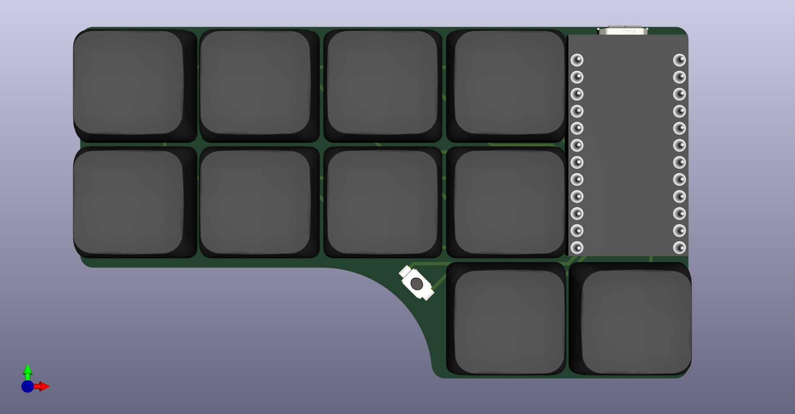

# РИСАТЕНО
 

РИСАТЕНО (__RISATENO__) - created as a rethinking of [ARTSEY](https://artsey.io/) for the Russian language. 10 keys, two for each finger.

РИСАТЕНО designed for one-handed chord typing, the layout can be viewed [here](http://www.keyboard-layout-editor.com/#/gists/019e404b4ab5db93cd75010ad90777a4) (__still in development__). 

The original idea was to create a compact keyboard for typing, but it can also be used as a macro pad.
 
The name is made up of letters on the main layer.

# Features
* 10 keys, Kailh Choc V1 switches
* Choc spacing
* Direct pins 
* Wireless(optional)
* Per switch RGB(optional)
* Power switch for wireless controllers(optional)

# Inspiration

* [ARTSEY](https://artsey.io/)
* [The Paintbrush](https://github.com/artseyio/thepaintbrus)
* [Helix](https://github.com/MakotoKurauchi/helix)
* [wakizashi](https://klava.wiki/hypha/%D0%BA%D0%BB%D0%B0%D0%B2%D0%B8%D0%B0%D1%82%D1%83%D1%80%D1%8B/%D0%B2%D0%B0%D0%BA%D0%B8%D0%B4%D0%B7%D0%B0%D1%81%D0%B8) (saw after the release of PNCATEHO)

# Options
РИСАТЕНО can be used with [nRFMicro](https://github.com/joric/nrfmicro) or [nice!nano](https://nicekeyboards.com/nice-nano/) and 301230 batteries for wireless mode. It can also be used as a split keyboard for two hands with wireless communication of the halves.

РИСАТЕНО RGB is designed only for wired use.

From version 0.2 the PCB are double-sided, one PCB can be used for the right and left variant. On the left version, the controller is soldered components down, on the right, components up.

# BOM

|Item                |Quantity| Remarks                            |
|--------------------|-------:|------------------------------------|
| proMicro           |  1     | or any other compatible controller |
| Kailh Choc V1      |  10    | switches                           |
| Keycaps            |  10    | 1U                                 |
| YS-SK6812MINI-E    |  10    | RGB leds                           |
| Bumpers            |  6-10  |                                    |
| Sockets            |  12x2  | for controller                     |
| SMD button 3x4x2mm |  1     | for reset                          |
| MSK-12C02          |  1     | Power switch  (wireless only)      |
| 301230             |  1     | Battery  (wireless only)           |

# Build guide
1. Solder the controller sockets
2. Solder the power switch (wireless only)
3. Solder the reset button
4. Solder the battery (only for wireless version)
5. Solder the pins into the controller (On the left version, the controller is soldered components down, on the right, components up.)
6. Solder 10 Kailh Choc V1 switches
7. Solder 10 LEDs (RGB version only)
8. Put the keycaps on the switches
9. Stick Bumpers
10. Insert controller into sockets
11. Flash the bootloader (see the official manual for the controller)
12. Flash the firmware (see the official manual for the controller)

[Soldering Tutorial for Beginners](https://mightyohm.com/files/soldercomic/FullSolderComic_EN.pdf) ([RU version](https://sho0.neocities.org/downloads/komiks_payat_prosto.pdf))