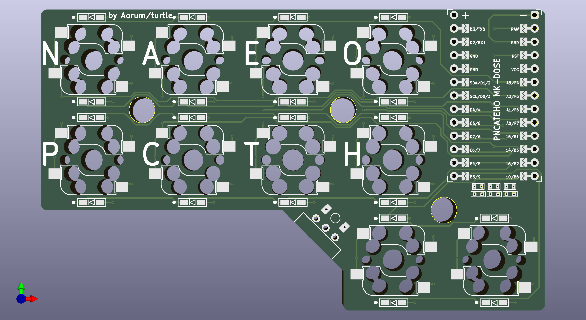

# РИСАТЕНО

РИСАТЕНО (__RISATENO__) - created as a rethinking of [ARTSEY](https://artsey.io/) for the Russian language. 10 keys, two for each finger.

The name is made up of letters on the main layer. The letters on the base layer are selected according to the [frequency](https://ru.wikipedia.org/wiki/%D0%A7%D0%B0%D1%81%D1%82%D0%BE%D1%82%D0%BD%D0%BE%D1%81%D1%82%D1%8C).

# Eras

Several eras of PNCATEHO developments exists

## [STONE](stone/README.md)

Classic bare stone version of PNCATEHO, old and mature enough, only Choc V1, no hotswaps. Only v4 currentrly found in this era.

## [GLASS](glass/README.md)

Current era of PNCATEHO development. Hotswap sockets, new fully closed case, some of new swithces. v5 and MK_DOSE are evolving in this era.

## [LIGHT](glass/README.md)

PNCATEHO hasn't reached the light era yet.

# Inspiration

* [ARTSEY](https://artsey.io/)
* [The Paintbrush](https://github.com/artseyio/thepaintbrush)
* [Helix](https://github.com/MakotoKurauchi/helix)
* [wakizashi](https://klava.wiki/hypha/%D0%BA%D0%BB%D0%B0%D0%B2%D0%B8%D0%B0%D1%82%D1%83%D1%80%D1%8B/%D0%B2%D0%B0%D0%BA%D0%B8%D0%B4%D0%B7%D0%B0%D1%81%D0%B8) (saw after the release of PNCATEHO)

# Firmware
Information about supported firmware can be found [here](firmware/README.md).

# Layouts
РИСАТЕНО designed for one-handed chord typing, the layout [here](http://www.keyboard-layout-editor.com/#/gists/019e404b4ab5db93cd75010ad90777a4). 

The original idea was to create a compact keyboard for chord typing, but it can also be used as a macro pad.

When using two halves of РИСАТЕНО connected via Bluetooth, you can use the [Kladenets layout](https://ibnteo.github.io/kladenets/).

