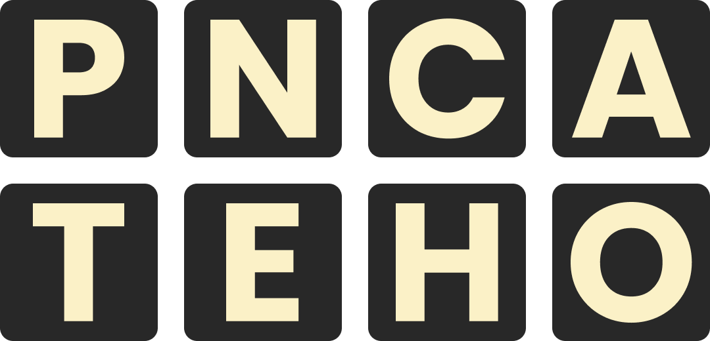
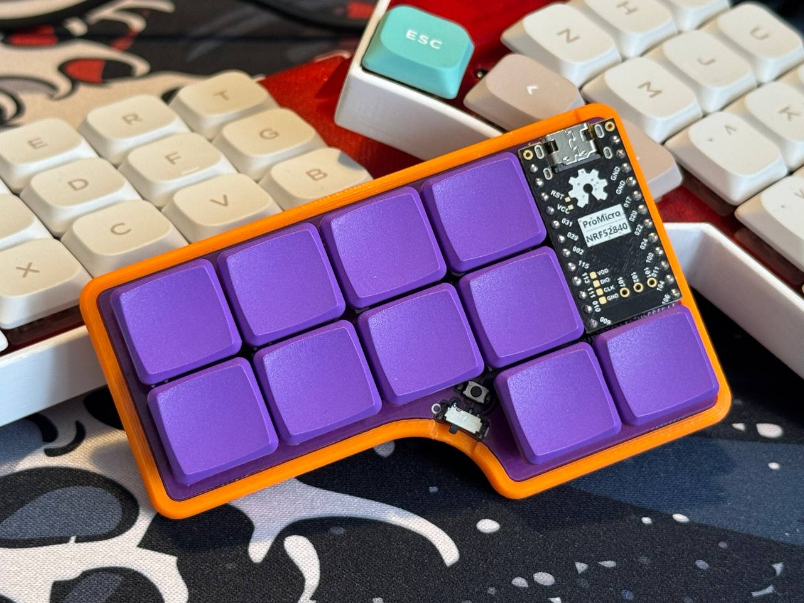
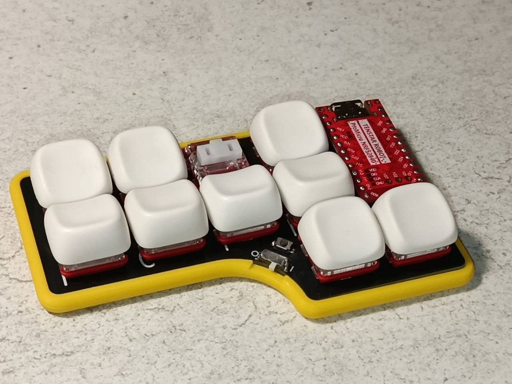
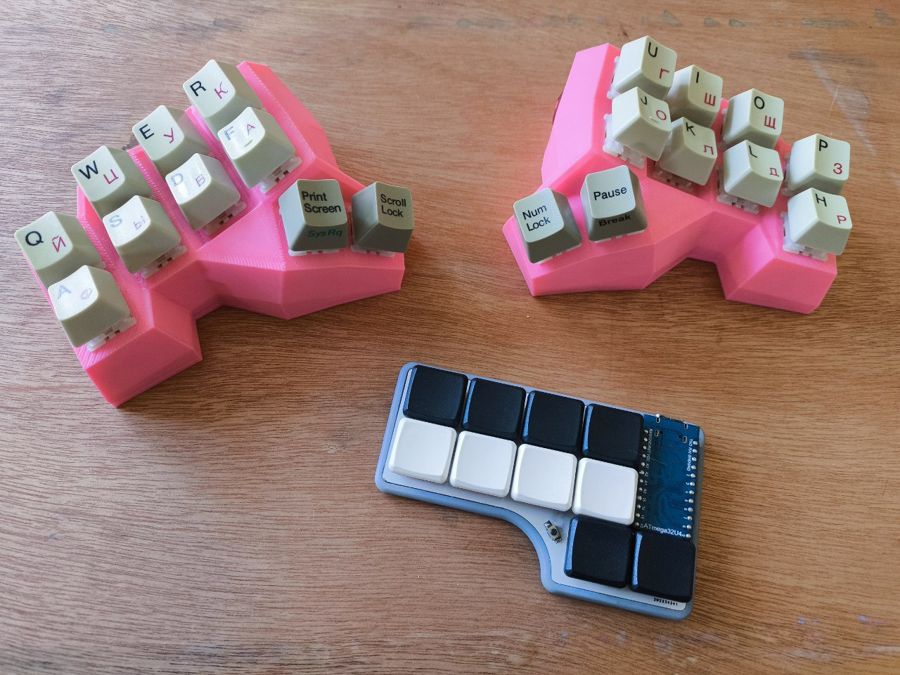
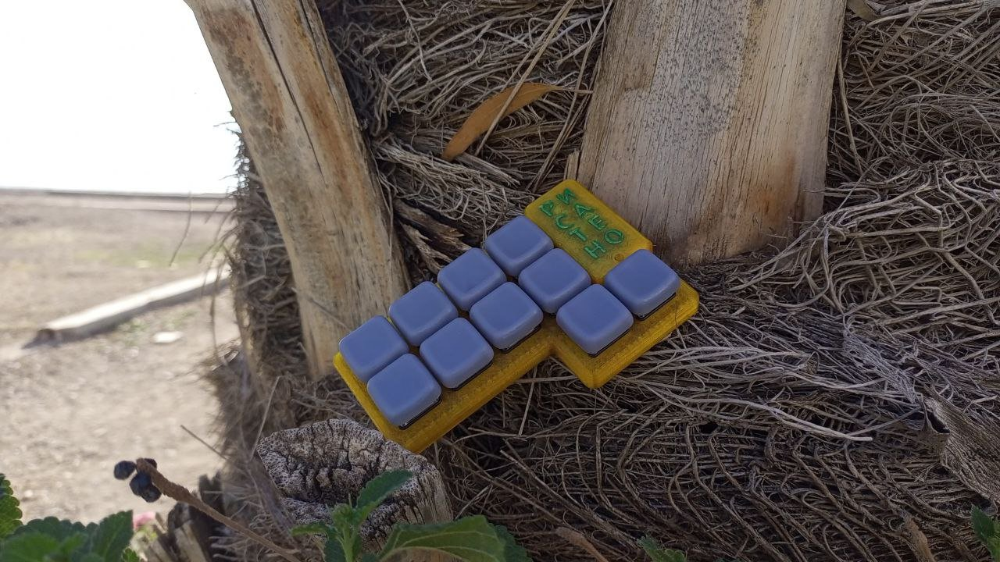
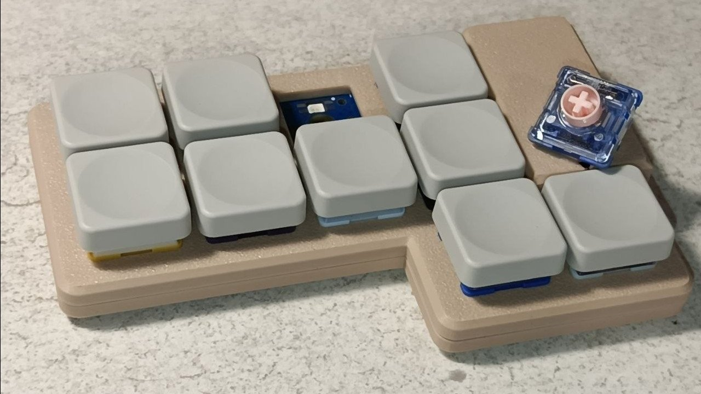
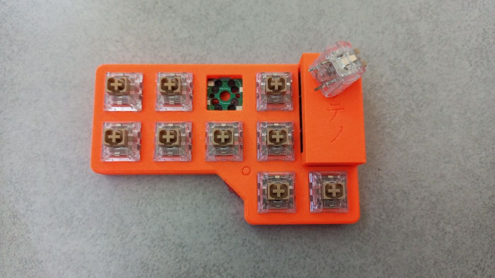
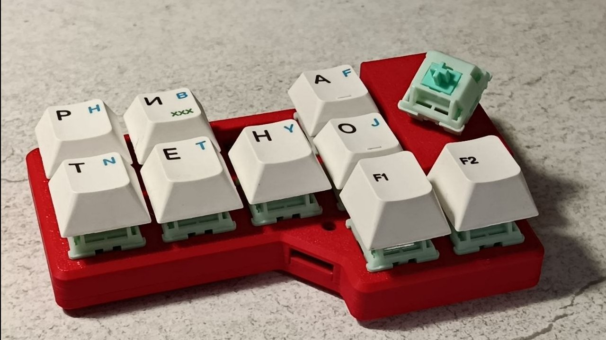
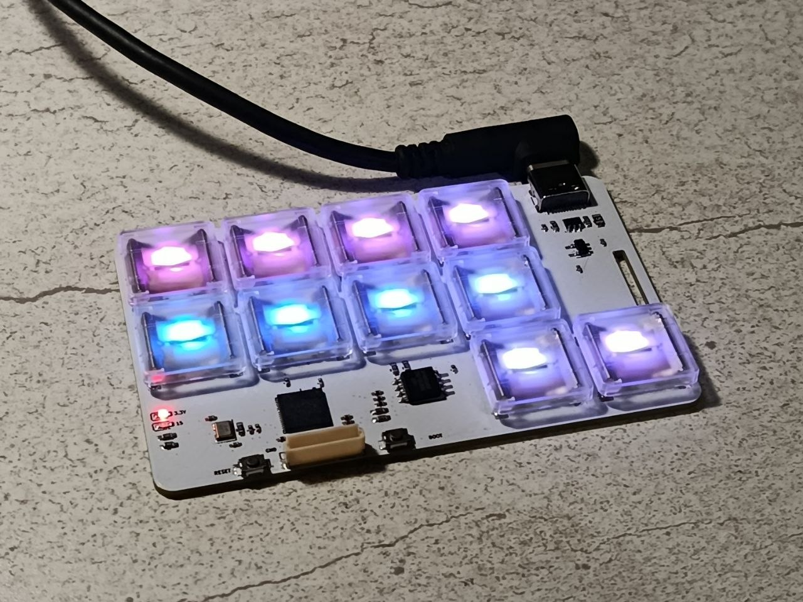
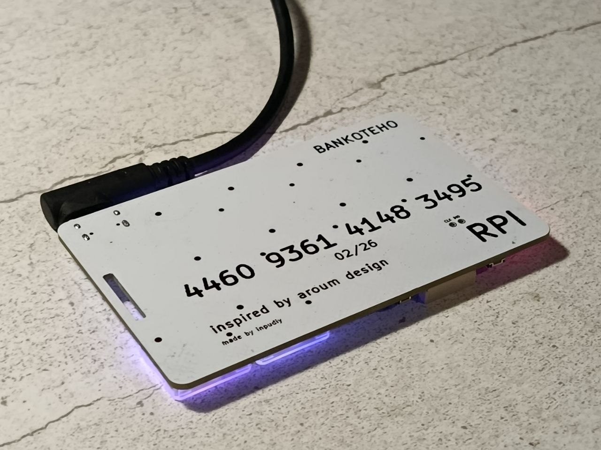

  

  
  
  

  <a href="https://github.com/inpudiy/PNCATEHO-Firmware">Firmware | </a> 
  <a href="https://github.com/aroum/PNCATEHO/releases">Gerber | </a>
  <a href="../doc/socket.md">About socket</a>

---

## About

РИСАТЕНО (__RISATENO__) - created as a rethinking of [ARTSEY](https://artsey.io/) for the Russian language. 10 keys, two for each finger. The name is made up of letters on the main layer. The letters on the base layer are selected according to the. The original idea was to create a compact keyboard for chord typing, but it can also be used as a macro pad. When using two halves of РИСАТЕНО connected via Bluetooth, you can use the [Kladenets layout](https://ibnteo.github.io/kladenets/).

## Eras
Eras are a way to classify different versions of a project. The Stone Era reflects original ideas. The Glass Era reflects the community's desires and experiments with new switches. The Light Era illuminates the vision of the creators who use this project as a platform for professional growth and attempt what others were afraid to do.

| Name    | Era   | Swtiches   | Hot-swap | Led              | Wireless |
| ------- | ----- | ---------- | -------- | ---------------- | -------- |
| V4      | Stone | Choc V1    | ❌        | Per-key          | Optional |
| V5      | Glass | Choc V1/V2 | ✅        | Per-key          | Optional |
| MK_Dose | Glass | MK Dose/MX | ✅        | 3 Led indication | Optional |
| Welcome | Light | ULP        | ❌     | Per-key          | ❌     |

### Stone
The standard version of PNCATEHO from the Stone era. Supports per-key backlighting, the option to use a wireless controller with an external power switch and reset button, and an open case. It does not support hot-swapping switches and only supports Choc V1. [more about stone](stone/readme.md)

> [!WARNING]  
> In version 0.3 of the board there is a bug with the backlight on the right-hand half.

#### V0.3

  
  

#### 3D

  

### Glass 
The modern era of PNCATEHO development. It differs from the Stone era in that it supports hot-swappable keys and ChocV1/V2, MK Dose, and MX switches. It also uses closed cases and a new design approach by turtle_bazon. [more about Glass](glass/readme.md)

> [!TIP]
> If you want to build a PNCATEHO with MX switches, you can use the PCB from MK Dose.

#### V5

  
  

#### MK_Dose

  
  

### Light
This is an era where the controller is soldered directly onto the PCB, exploring various form factors such as, for example, a PNCATEHO the size of a card. A project can become a flashlight, a development board, or even a portable gaming console. It all depends on the imagination of the community. The main contribution to this era has been made by the authors of the inpudiy community. [more about light](light/readme.md)

#### Welcome

  
  

## FAQ

### What is it for?

As I’ve said many times, RISATENO is a fun project. It shouldn’t be treated as an everyday keyboard — it’s more like a souvenir, a kind of fridge magnet. That said, some people even try to use RISATENO ideas in keyboards they type on daily.

In many ways, the project was created as a testing ground for experimenting with chords and exploring how much the number of keys can actually be minimized. And of course, nothing stops you from using RISATENO as a macropad.

I tried to make the layout simpler and more intuitive, while still keeping it almost a full replacement for a full-sized keyboard. Unlike ARTSEY, I don’t use chords involving more than two keys, and I designed the layout based on letter frequency rather than picking letters that sound nice together. I also added two thumb keys — it feels odd to give every finger two keys but none to the thumbs.

### Why RISATENO?

Pncateho is a loose transliteration of “рисатено” into the Latin alphabet. The layout was designed based on letter frequency ([Wikipedia](https://ru.wikipedia.org/wiki/%D0%A7%D0%B0%D1%81%D1%82%D0%BE%D1%82%D0%BD%D0%BE%D1%81%D1%82%D1%8C)), and the first eight letters are four vowels and four consonants. To get a pronounceable name, you can combine them into syllables — reading one way gives **RISATENO**, the other gives **NOTESARI** (options like “ONETASIR” were discarded as awkward-sounding). The second option feels a bit too “samurai,” so I went with the first.

As a nice bonus, aside from the letter “И,” the name transliterates well into Latin, and the letter “N” works well as a substitute for “И.”

### Why not ergonomic?

RISATENO isn’t meant to be an everyday keyboard — here aesthetics matter more than ergonomics, and ortholinear layouts look much nicer in my opinion.

### How do you type on it?

Letter by letter, “dancing” your fingers to form chords. I tried to distribute chords by ease of pressing, so that the most common symbols use the simplest and most comfortable combinations. With some effort, you can learn all the common chords in a couple of days and, although slowly, fully type using just 10 keys with one hand.

It’s quite an unusual experience, especially if you’ve never used chords before. I strongly recommend printing the layout ([GitHub](https://github.com/aroum/PNCATEHO/tree/master/firmware)) and opening any beginner touch-typing app — even if you already know how to type on a regular keyboard, this will be a completely new and unique experience that you’ll likely never need anywhere else.

### Is this steno?

No, steno works completely differently ([example layout](https://github.com/openstenoproject/plover/files/247728/Russian.alphabet.and.layout.pdf)). It requires more keys and a different method. RISATENO, on the other hand, is letter-by-letter input based on frequency.

If you’re interested in steno, it’s worth starting with [Plover](https://www.openstenoproject.org/plover/).

## Inspiration
* [ARTSEY](https://artsey.io/)
* [The Paintbrush](https://github.com/artseyio/thepaintbrush)
* [Helix](https://github.com/MakotoKurauchi/helix)
* [wakizashi](https://klava.wiki/hypha/%D0%BA%D0%BB%D0%B0%D0%B2%D0%B8%D0%B0%D1%82%D1%83%D1%80%D1%8B/%D0%B2%D0%B0%D0%BA%D0%B8%D0%B4%D0%B7%D0%B0%D1%81%D0%B8) (saw after the release of PNCATEHO)

## Contribute list
* [aroum](https://github.com/aroum)
* [mayoroffk](https://github.com/mayoroffk)
* [turtle-bazon](https://github.com/turtle-bazon)
* [miwoho](https://github.com/miwoho)
