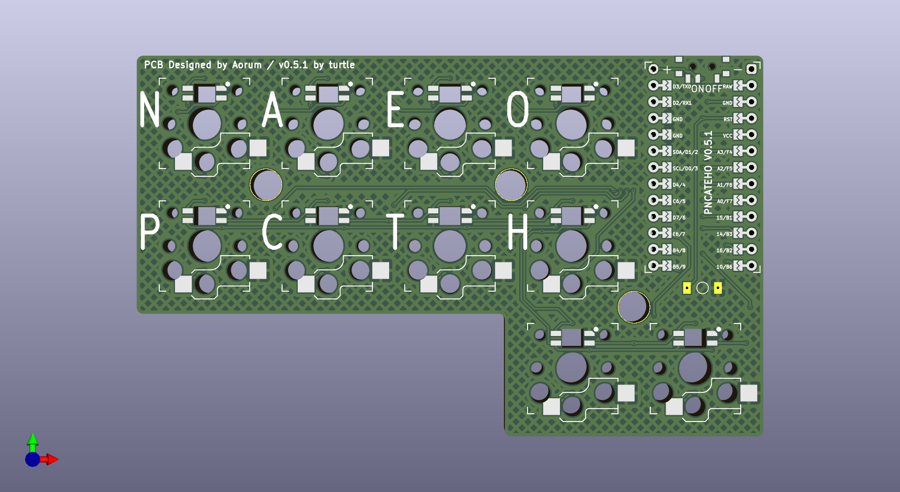
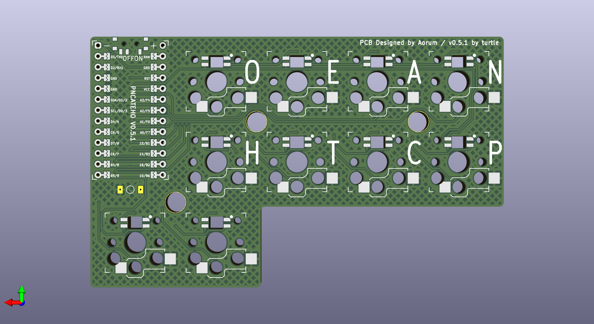

# РИСАТЕНО

РИСАТЕНО (__RISATENO__) - created as a rethinking of [ARTSEY](https://artsey.io/) for the Russian language. 10 keys, two for each finger.

The name is made up of letters on the main layer. The letters on the base layer are selected according to the [frequency](https://ru.wikipedia.org/wiki/%D0%A7%D0%B0%D1%81%D1%82%D0%BE%D1%82%D0%BD%D0%BE%D1%81%D1%82%D1%8C).

# Renders

## assembled

## top side pcb

## bottom side pcb

# Features

* 10 keys, Kailh Choc V1/V2 switches
* HotSwap
* MX spacing
* Direct pins 
* Mainly Wireless, Wired optional
* Per switch RGB (optional)
* Two halves placed on one 100x100mm pcb (optional)
* Three mounting screws
* One PCB for right and left versions

# Inspiration

* [ARTSEY](https://artsey.io/)
* [The Paintbrush](https://github.com/artseyio/thepaintbrush)
* [Helix](https://github.com/MakotoKurauchi/helix)
* [wakizashi](https://klava.wiki/hypha/%D0%BA%D0%BB%D0%B0%D0%B2%D0%B8%D0%B0%D1%82%D1%83%D1%80%D1%8B/%D0%B2%D0%B0%D0%BA%D0%B8%D0%B4%D0%B7%D0%B0%D1%81%D0%B8) (saw after the release of PNCATEHO)

# Options

РИСАТЕНО can be used with [nRFMicro](https://github.com/joric/nrfmicro) or [nice!nano](https://nicekeyboards.com/nice-nano/) and 301230 batteries for wireless mode. It can also be used as a split keyboard for two hands with wireless communication of the halves.

From version 0.2+ the PCB are double-sided, one PCB can be used for the right and left variant. On the left version, the controller is soldered components down, on the right, components up.

# Layouts

РИСАТЕНО designed for one-handed chord typing, the layout [here](http://www.keyboard-layout-editor.com/#/gists/019e404b4ab5db93cd75010ad90777a4). 

The original idea was to create a compact keyboard for chord typing, but it can also be used as a macro pad.

When using two halves of РИСАТЕНО connected via Bluetooth, you can use the [Kladenets layout](https://ibnteo.github.io/kladenets/).

# BOM

| Item                                                                       | Quantity | Remarks                              |
| -------------------------------------------------------------------------- | -------: | ------------------------------------ |
| [NRFproMicro](https://aliexpress.com/item/1005007088422530.html)           | 1        | Recommended option                   |
| [RP2040ProMicro](https://aliexpress.com/item/1005006787060405.html)        | 1        | (option)                             |
| [proMicro](https://aliexpress.com/item/32840365436.html)                   | 1        | (option) not recommended             |
| [Kailh HotSwap sockets](https://aliexpress.com/item/1005003873653184.html) | 10       | 1350 for low profile                 |
| [Kailh Choc V2](https://aliexpress.com/item/1005008651091078.html)         | 10       | switches                             |
| [Kailh Choc V1](https://aliexpress.com/item/32959996455.html)              | 10       | (option) switches                    |
| Any ChocV1 or ChocV2 compatible keycaps                                    | 10       | 1U                                   |
| [YS-SK6812MINI-E](https://aliexpress.comj/item/4000475685852.html)         | 10       | RGB leds                             |
| Strong Magnets                                                             | 5        | disc 7x3 mm (for case)               |
| [Bumpers](https://aliexpress.com/item/4001188580018.html)                  | 5        | 8x2 mm                               |
| [Sockets PH3.5](https://aliexpress.com/item/1005006673257121.html)         | 12x2     | Female (for controller)              |
| [RGB Pins](https://aliexpress.com/item/1005006359264558.html)              | 12x2     | (for controller)                     |
| [SMD button 3x4x2mm](https://aliexpress.com/item/1005008598353804.html)    | 1        | for reset                            |
| [MSK-12C02](https://aliexpress.com/item/1005006710234187.html)             | 1        | Power switch  (wireless only)        |
| [301230](https://aliexpress.com/item/32732458079.html)                     | 1        | Battery  (wireless only)             |
| [m2x6 screws](https://aliexpress.com/item/1005002136927329.html)           | 3        | for case                             |

# Build guide

1. Solder the 1350 hotswap sockets (solder from the bottom side).
2. Solder the controller sockets (solder from the bottom side).
3. Solder the power switch (wireless version only) (solder from the bottom side).
4. Solder the reset button (solder from the top side).
5. Solder the battery (wireless version only) (solder from the top side).
6. Solder the pins into the controller (place the controller face down).
7. Solder 10 LEDs (RGB version only) (solder from the bottom side; LEDs should face upward from the bottom).
8. Print the bottom case, top case, power switch pusher, reset button pusher, and top case cover.
9. Place the power switch pusher, position the PCB between the bottom and top cases, and screw them together.
10. Insert the reset button pusher into the top cover through the reset hole.
11. Insert the controller into the sockets.
12. Place the cover over the controller.
13. Insert the switches into the hotswap sockets.
14. Attach the keycaps to the switches.
15. Flash the bootloader (see the official manual for the controller).
16. Flash the firmware (see the official manual for the controller).

[Soldering Tutorial for Beginners](https://mightyohm.com/files/soldercomic/FullSolderComic_EN.pdf) ([RU version](https://sho0.neocities.org/downloads/komiks_payat_prosto.pdf))
