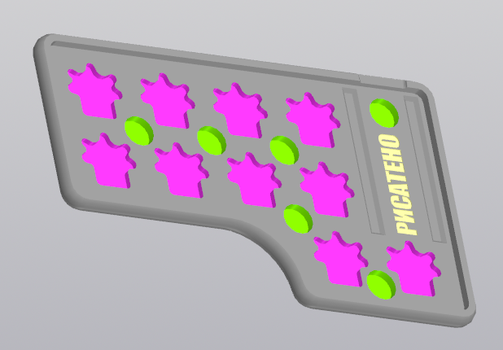

# CASE
 

For right-handed version you need to mirror the model.

The pcb is fixed by friction or double-sided tape.

# BOM
* magnets size: 7x2mm (2-6 pcs)
* bumpons size: 5x2mm (7 pcs)

# Print options:
* Printer: Voxelab proxima
* Rafts: No
* Supports: Yes
* Resolution: 0.05mm
* Resin material: ABS-like

STL models can be downloaded in [releases](https://github.com/aroum/PNCATEHO/releases).