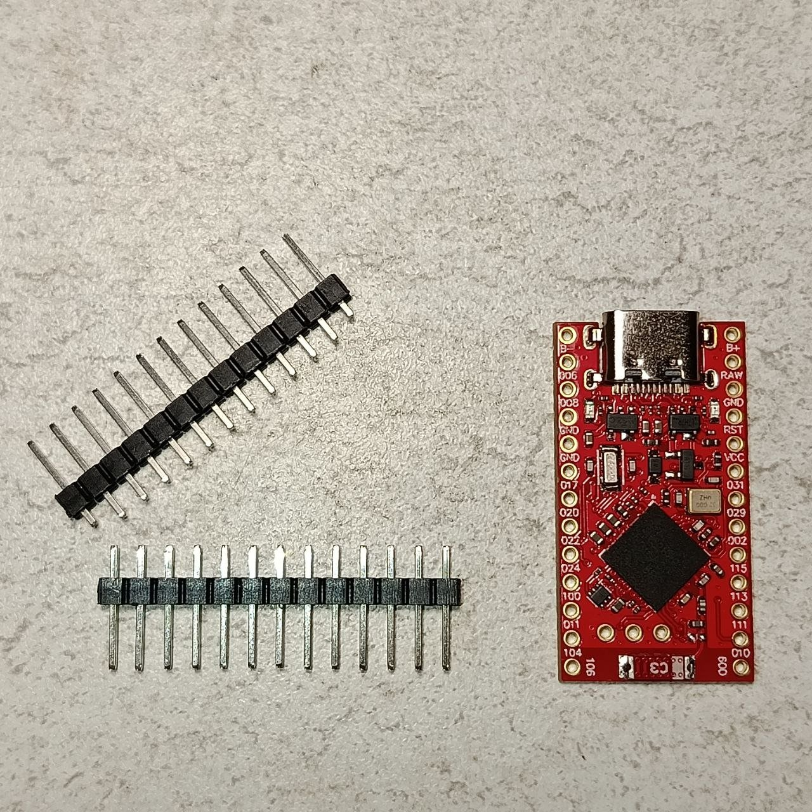
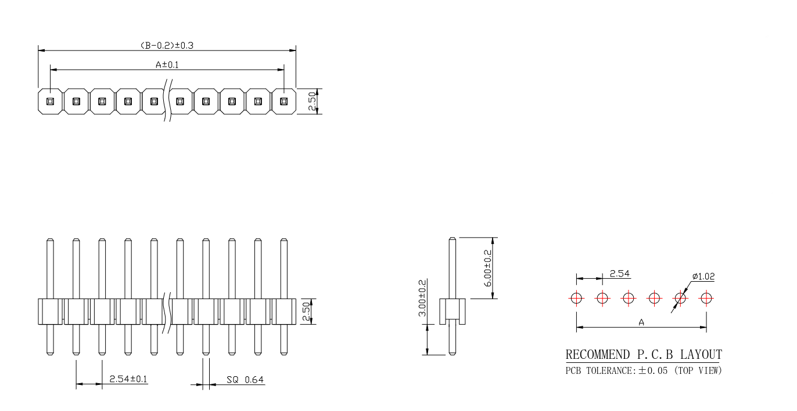
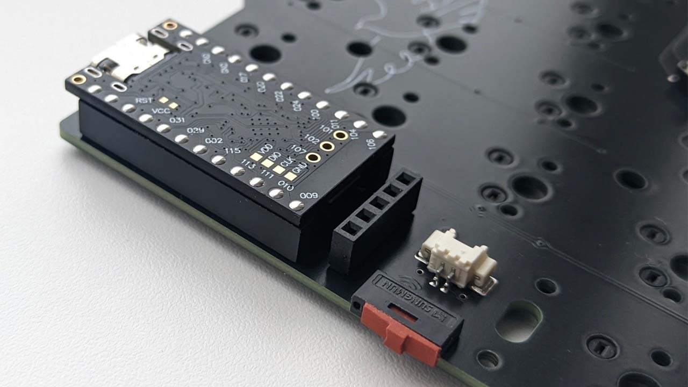
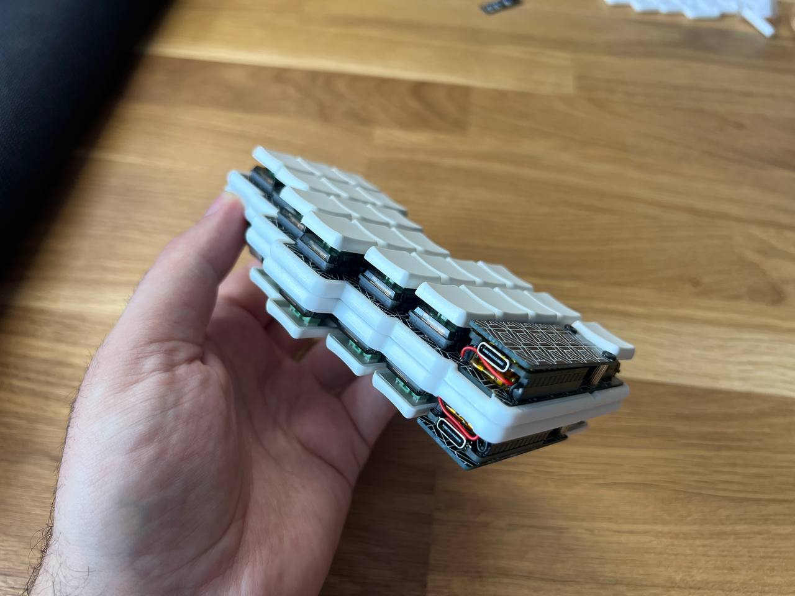
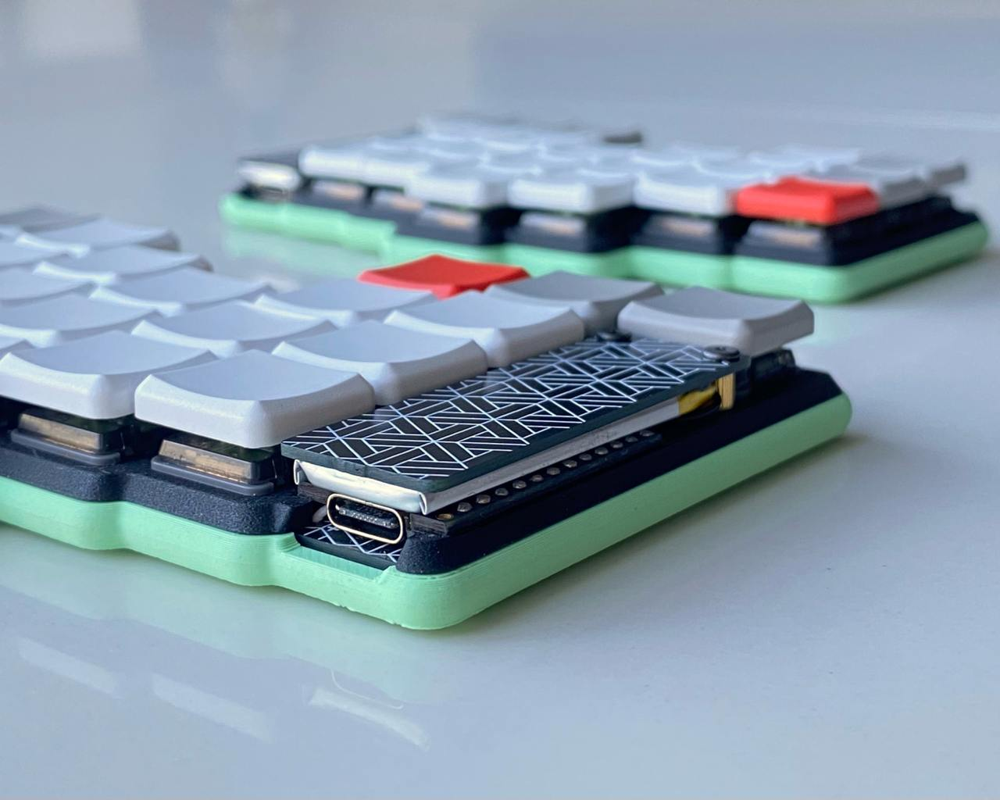

## Introduction

In order for a keyboard to register keystrokes, a microcontroller is used. Besides the microcontroller itself, it also requires supporting circuitry. Routing and soldering a board with a microcontroller significantly complicates the design and assembly process. To address this issue, development boards are used, which already have the microcontroller with the necessary supporting circuitry installed, as well as a charging module, a connection port, an antenna, and the required controller pins brought out, where the keyboard switches are directly connected.

In order to connect the keyboard switches to the development board, sockets are needed. Each creator uses their own solutions, so it is important to explain the differences between these approaches.

> [!IMPORTANT]
> The battery thickness may also depend on how the controller is installed. In most keyboards, controllers are mounted facing downward, so you need to subtract the height of the tallest component (the antenna or connector) from the socket height to determine the available space for the battery.

> [!WARNING]  
> PAY CLOSE ATTENTION TO THE SOCKET INFORMATION IN THE OFFICIAL REPOSITORY OF THE KEYBOARD YOU ARE BUILDING. DIFFERENT CONFIGURATIONS MAY BE USED FOR DIFFERENT CASE TYPES, EVEN WITHIN THE SAME PROJECT BUT IN DIFFERENT VERSIONS

## Main data

Let's start by defining the main data.

You might ask: why do we need a socket? Wouldn't it be simpler to just solder the boards together? Let’s imagine a situation where the development board fails, or conversely, the controller board is fine but the keyboard switches section is damaged. In such a case, you would have to desolder around 24 pins at once, or carefully remove solder from each pin individually. Trust me, you don’t want to do that—and if you do, it will take a lot of time and the chances of damaging the board increase significantly.

The solution to this problem is the use of sockets: female sockets are installed on the keyboard board, and male pins are soldered to the controller.

- Most likely, just like in PNCATEHO, your keyboard uses a Pro Micro–format board, which has 24 pins, and the board thickness is 1.6 mm (excluding components).
- On the vast majority of development boards, the pin spacing (pitch) is 2.54 mm.
- In popular wireless keyboard models, the battery most often used has dimensions H=3 mm, W=12 mm, and L=30 mm (301230).

## Dupont

### Square male pin header

A microcontroller development board comes with a row of **SQUARE** pins. These are sets of square posts held together by plastic, from which they can be easily removed. They can also be purchased separately in strips of 40 pins in different colors.

Due to the large number of manufacturers and the lack of strict quality control, the dimensions of these pins may differ from the datasheet by ±0.20 mm. For example, in my case, the plastic thickness is as much as 2.4 mm, while the pin length is only 11.32 mm instead of 11.5 mm.

### Square female pin header

To use the pins that come in the kit, you need to purchase square pin headers. For keyboards, different height options are used; the most popular ones are 3.5 mm, 5 mm, and 5.7 mm anything taller is generally excessive.

The main issue is that the required sizes can be harder to find on common marketplaces (AliExpress and others). However, their strength and compatibility with the included pins make this option more practical compared to machine pin sockets.

Among the most common configurations, the following approaches can be highlighted:

#### First option

There are also configurations where the controller is installed with the flat side facing inward, allowing for a thicker battery. The examples below use a configuration where the controller is facing the PCB.

Install the sockets into the controller, cut off the top part, and remove the plastic. Then insert them into 5 mm or 5.7 mm pin headers. This spacing between the board and the controller allows the use of a 3+ mm thick battery.

*The keyboard in the photo: [Mriya](https://github.com/themaxbang/MRIYA)*

#### Second option

Use 3.5 mm pin headers, and install the stock sockets into the controller without removing the plastic only trim the pins above the controller. This also allows using a 31 mm thick battery.

*The keyboard in the photo: [gbEnki](https://github.com/aroum/gbEnki)*

#### Third option

Use 3.5 mm pin headers, remove the plastic from the stock sockets, and place a battery between the controller and the shield above it.

## Machine

### Square female pin header
