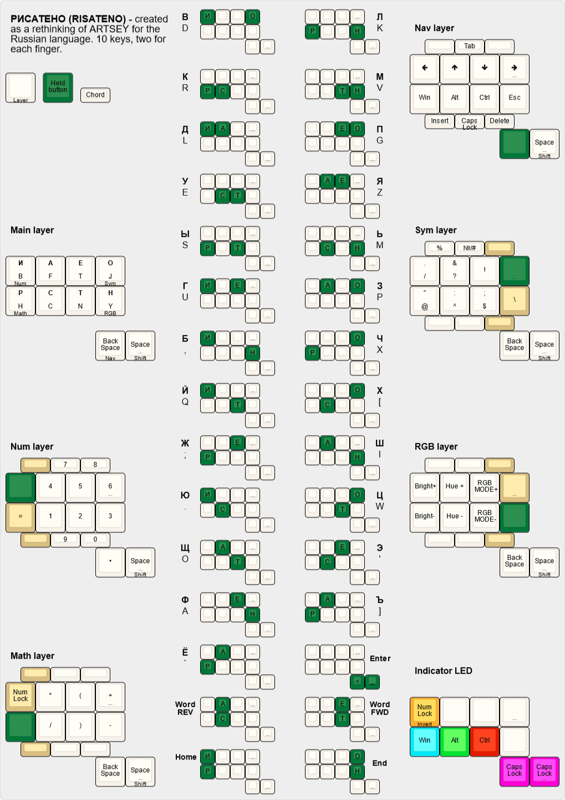

# Firmware
 


The main idea use only 2 keys chords.

## KLE

[Layout on the KLE website](http://www.keyboard-layout-editor.com/#/gists/019e404b4ab5db93cd75010ad90777a4)

[Unused chords on the KLE website](http://www.keyboard-layout-editor.com/#/gists/b4924b372f7e59832365545de1e1671c)

## QMK

* copy folder QMK/PNCATEHO to qmk/keyboards
* run ```qmk compile -kb PNCATEHO -km default```


Or just download in [releases](https://github.com/aroum/PNCATEHO/releases).
## ZMK

Config [here](https://github.com/aroum/zmk-PNCATEHO)
