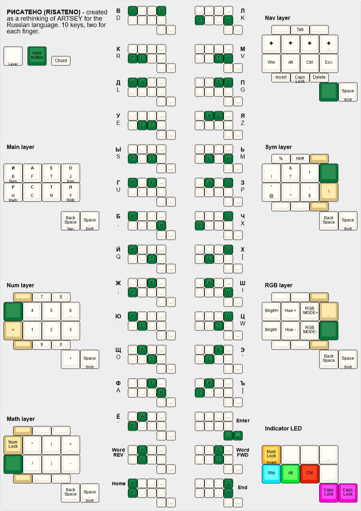

# Firmware

The core concept of PNCATEHO is to use only 2-key chords for all inputs, making it an efficient 10-key keyboard with extensive functionality.

## KLE

[Layout on the KLE website](http://www.keyboard-layout-editor.com/#/gists/019e404b4ab5db93cd75010ad90777a4)

[Unused chords on the KLE website](http://www.keyboard-layout-editor.com/#/gists/b4924b372f7e59832365545de1e1671c)

## QMK

QMK is the recommended firmware for most PNCATEHO variants. It provides full feature support including macros and layer switching.

**Installation:**

1. Copy the `QMK/PNCATEHO` folder to your QMK installation at `keyboards/pncateho`
2. Run `qmk compile -kb pncateho -km default`
3. Flash the resulting `.hex` file to your keyboard

Or download precompiled firmware from [releases](https://github.com/aroum/PNCATEHO/releases).

For more information, see [QMK documentation](https://docs.qmk.fm/).

## ZMK

ZMK is a lightweight firmware designed for wireless keyboards. Configuration and builds are available in separate repositories:

- **For nizkoteno**: [ZMK config for nizkore](https://github.com/inpudiy/zmk-PNCATEHO_Welcome_keyboard)
- **For other variants**: [ZMK config for PNCATEHO](https://github.com/aroum/zmk-PNCATEHO)

## RMK

RMK (Rust Mechanical Keyboard) is a Rust-based firmware for RP2040 microcontrollers. The implementation is optimized for nizkoteno but can be adapted to other PNCATEHO variants by modifying the pin configuration.

- Repository: [rmk-nizkoteno](https://github.com/aroum/rmk-nizkoteno/)
- **Compatibility:** Works with any PNCATEHO variant (except dozateno) when using an RP2040-based microcontroller

## MIDI

A simple MIDI keyboard implementation for nizkoteno. This firmware turns your PNCATEHO into a MIDI controller, perfect for music production and DAW integration.

- Repository: [midi-nizkoteno](https://github.com/aroum/midi-nizkoteno)
- **Compatibility:** Works with any PNCATEHO variant (except dozateno) when using an RP2040-based microcontroller with adjusted pin configuration

## nizkore

A sampler firmware port from pikocore, offering sound playback and sequencing capabilities. Originally created for nizkore but can be adapted to other PNCATEHO variants.

- Repository: [nizkore](https://github.com/aroum/nizkore/)
- **Compatibility:** Works with any PNCATEHO variant (except dozateno) when using an RP2040-based microcontroller with adjusted pin configuration

## pra32-u

A synthesizer firmware port optimized for the nizkoteno form factor. Enables real-time synthesis and parameter control directly from the keyboard.

- Repository: [pra32-u-pico-sdk](https://github.com/aroum/pra32-u-pico-sdk/)
- **Compatibility:** Works with any PNCATEHO variant (except dozateno) when using an RP2040-based microcontroller with adjusted pin configuration
