## Diode

Solder the diodes, aligning the stripe on each diode with the stripe marked on the PCB.

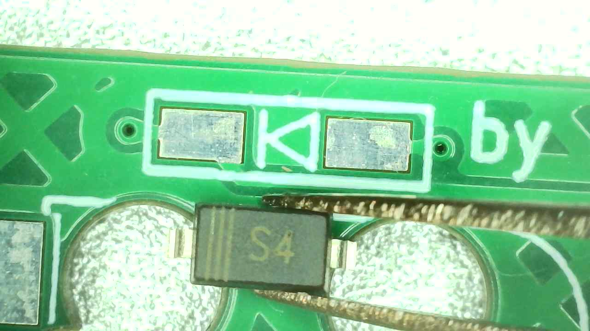

## Hotswap

For the MX version, solder one hot-swap socket on the underside of the PCB. Install the socket next to the previously soldered diode. For the MK Dose version, solder both hot-swap sockets.

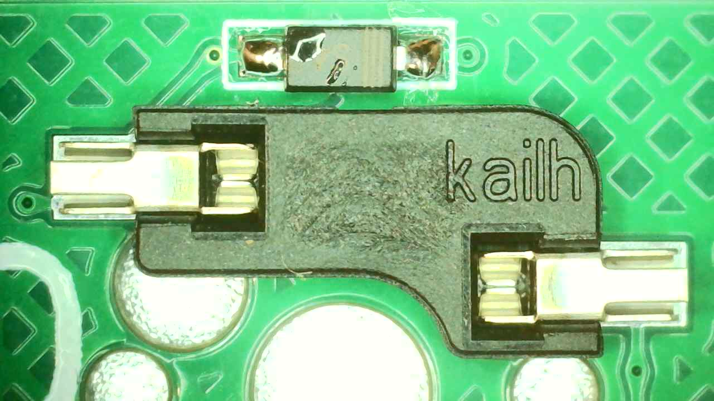
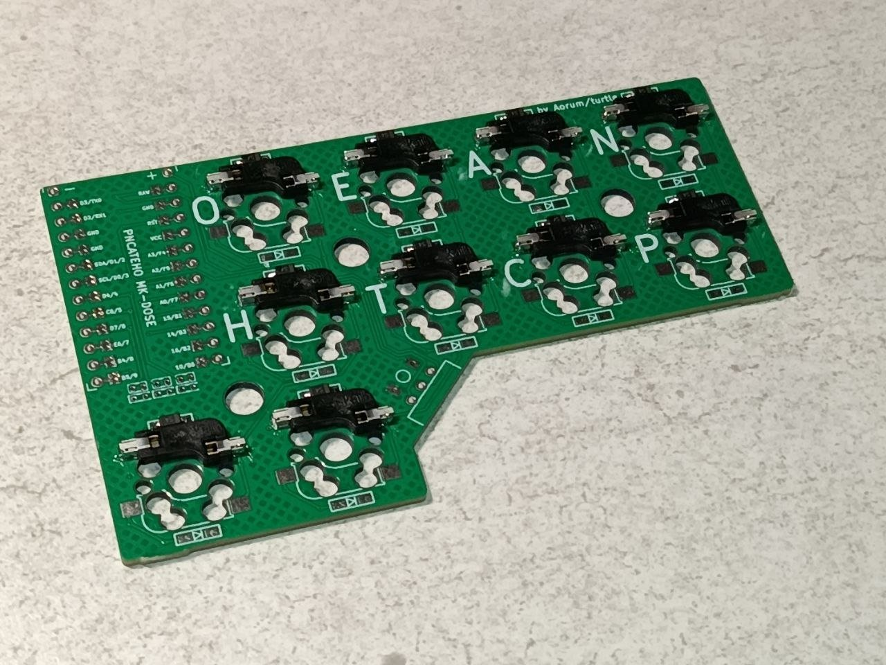

## Led

In the controller area, install 3 resistors on the pads above and 3 LEDs on the pads below. Position the cathode toward the bracket marking.

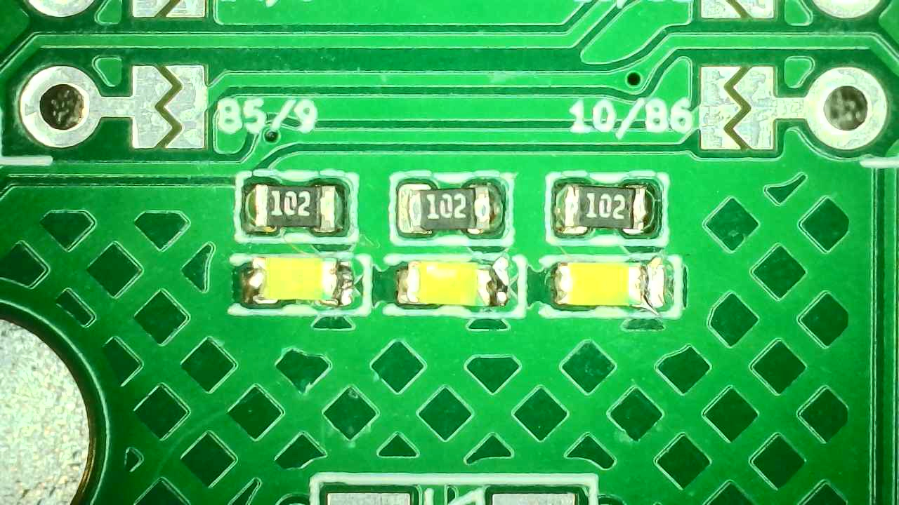

## MCU Board
>
> [!WARNING]
> BE CAREFUL AND USE EYE PROTECTION WHEN CUTTING PLASTIC AND PINS. When trimming, cover the area with your hand to reduce the risk of small pieces of plastic or metal pins flying off toward your face or monitor.

Solder the jumpers on the underside of the PCB near the controller pins.

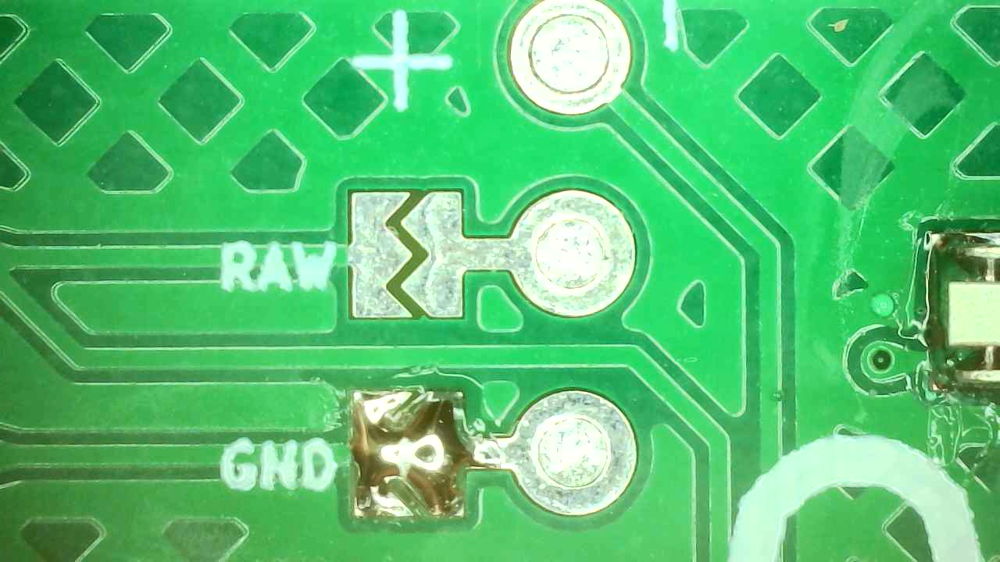

Then install the headers with the socket facing upward and solder the pin supports (also from the underside). Leave the space for the battery pins empty and do not install any pins there.

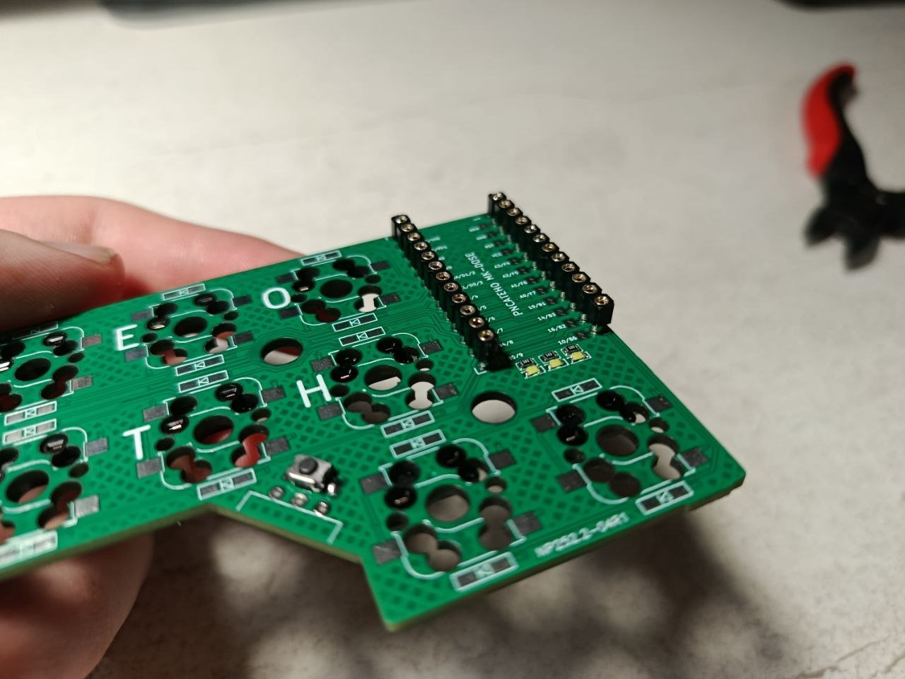
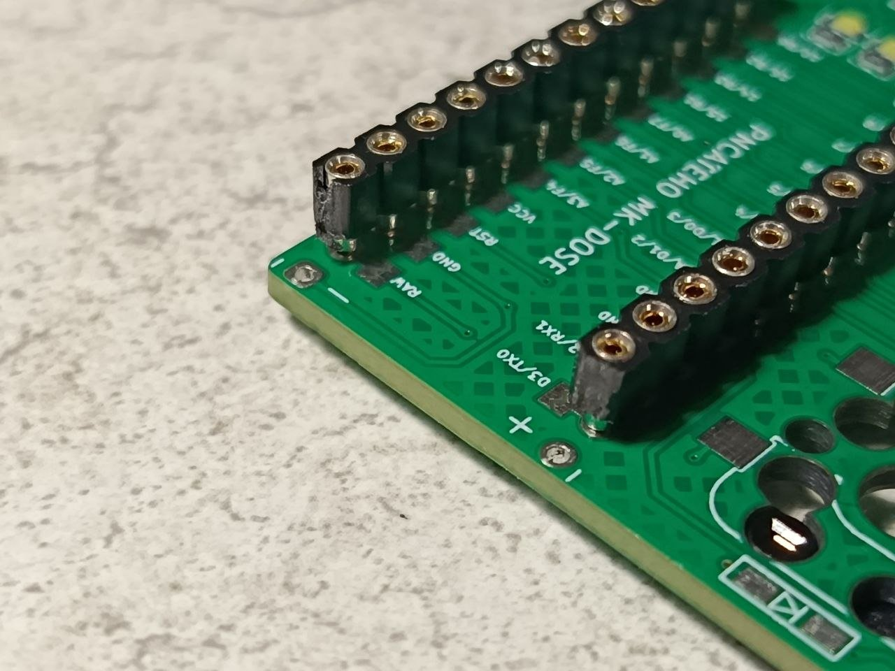

Install the controller on top of the sockets. Then take a piece of wire or an RGB pin and cut it flush with the controller [see details here](../doc/socket.md). After that, solder all the pins to the controller.

To check that all pins are properly soldered, try to gently remove the controller from the sockets using something long and straight to avoid bending the pins.

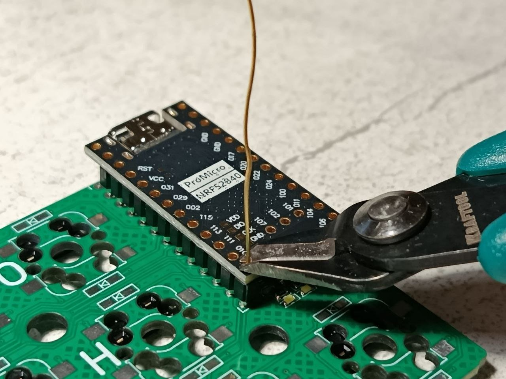
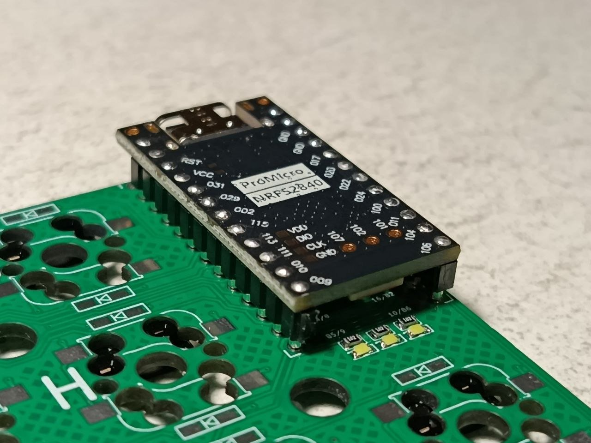

## Button and slider

Install the reset button and the BSI-10H connector. Trim the legs of the BSI on the underside of the PCB before soldering.

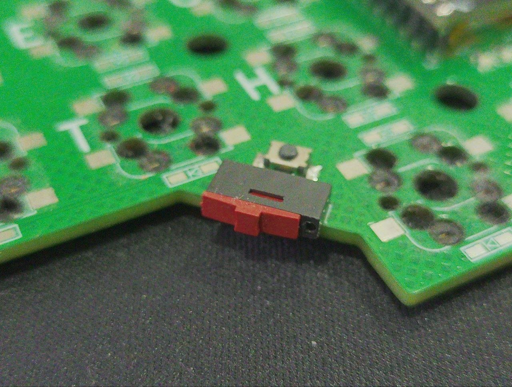

## Case

Insert the PCB into the case. Tighten the case with screws from the bottom, then attach the feet.

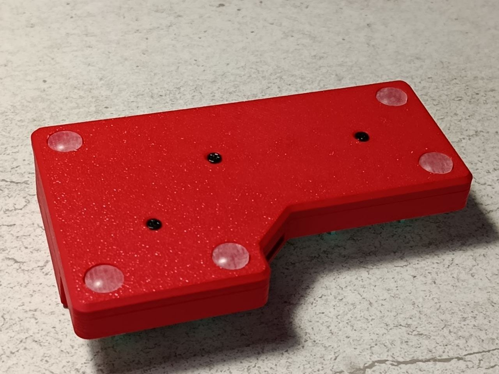

## Finish

Install the keycaps. Then connect the controller to your computer with a cable, press the reset button twice, and flash the firmware.

**Congratulations, you’ve assembled your РИСАТЕНО!**

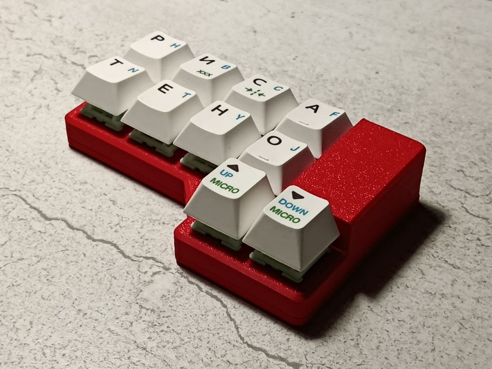
