## Hotswap

Install all the hot-swap sockets and solder them in place. Carefully check the silkscreen on the PCB and align each socket accordingly.

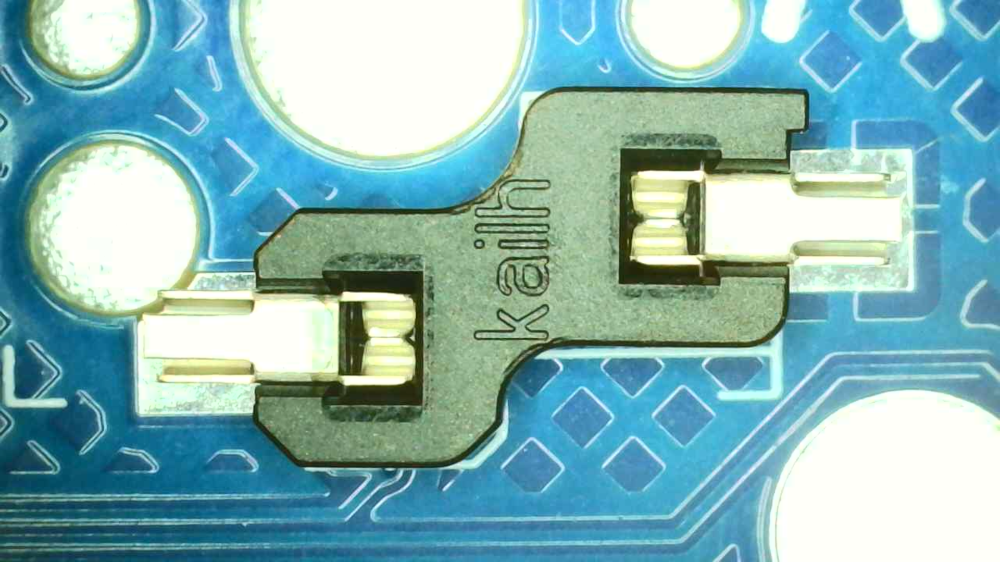

## Led

Install the YS-SK6812MINI-E LEDs by aligning the angled pin of the LED with the dot on the PCB. Repeat this for all LEDs, then solder them in place.

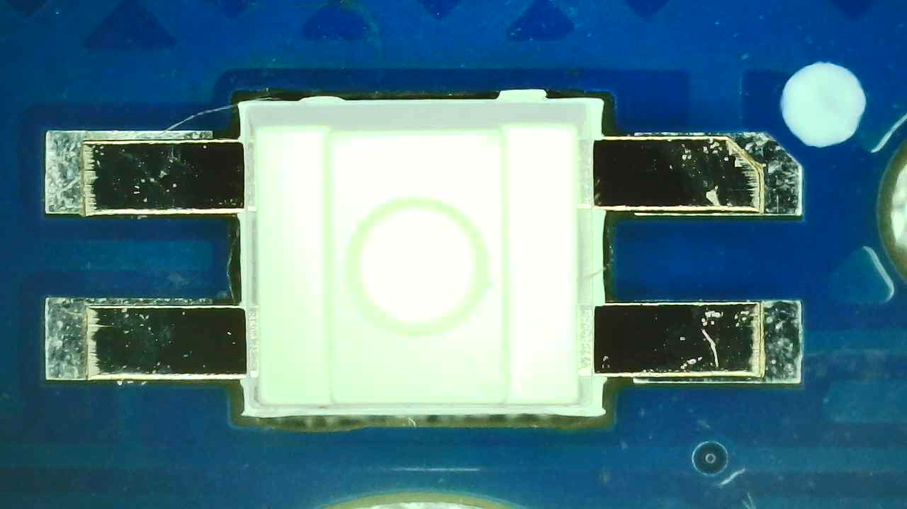

## MCU Board
>
> [!WARNING]
> BE CAREFUL AND USE EYE PROTECTION WHEN CUTTING PLASTIC AND PINS. When trimming, cover the area with your hand to reduce the risk of small pieces of plastic or metal pins flying off toward your face or monitor.

Solder the jumpers on the underside of the PCB near the controller pins.

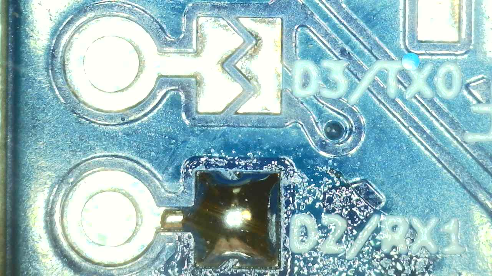
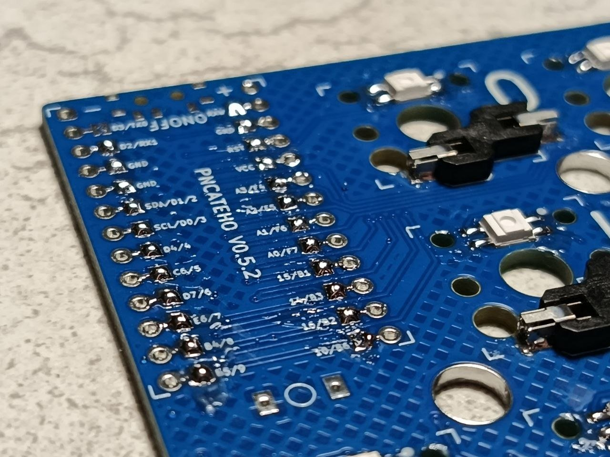

Then install the headers with the socket facing upward and solder the pin supports (also from the underside). Leave the space for the battery pins empty and do not install any pins there.

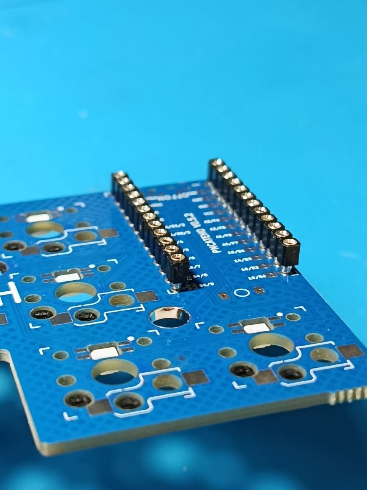
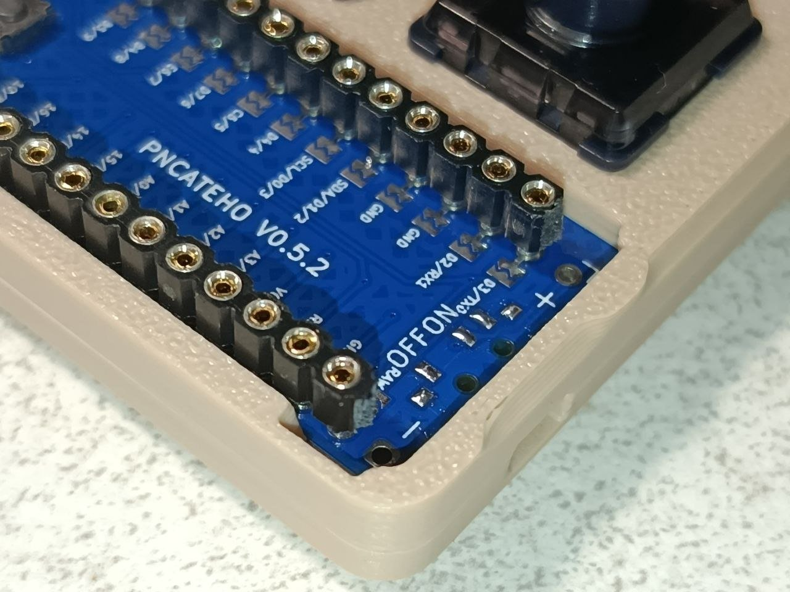

Install the controller on top of the sockets. Then take a piece of wire or an RGB pin and cut it flush with the controller [see details here](../doc/socket.md). After that, solder all the pins to the controller.

To check that all pins are properly soldered, try to gently remove the controller from the sockets using something long and straight to avoid bending the pins.

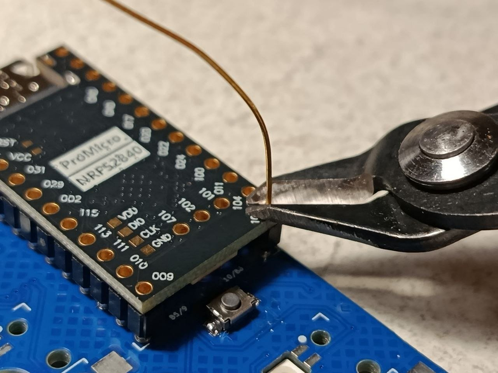
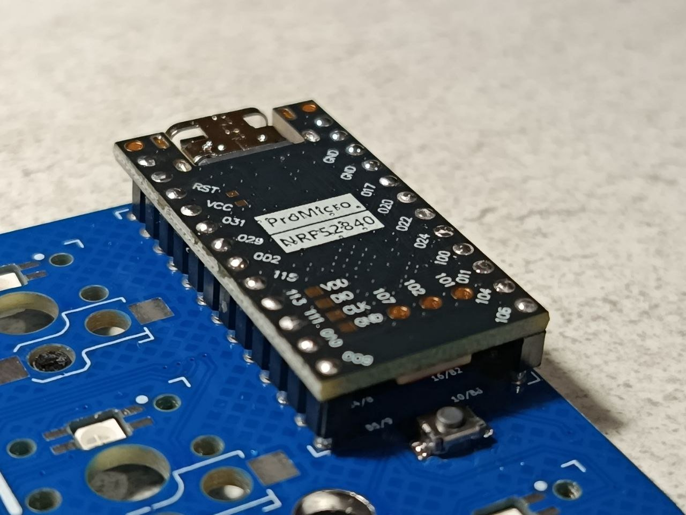

## Button and slider

Solder the reset button on the top side of the PCB, and the power switch on the bottom side.

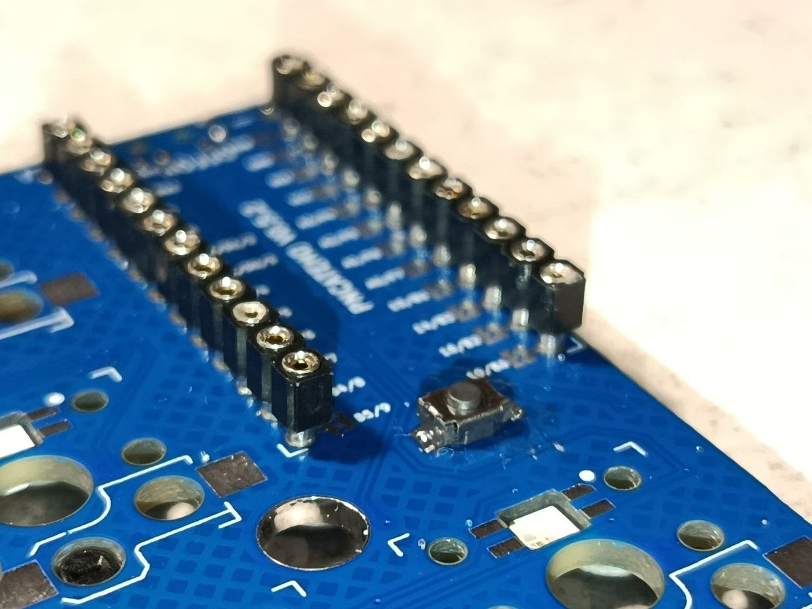
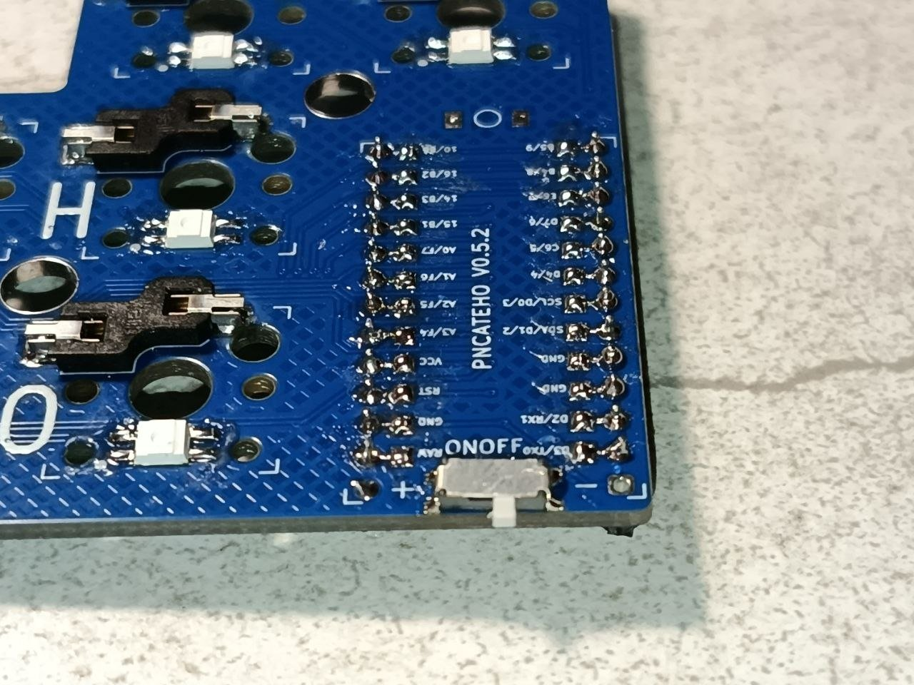

## Case

Insert the PCB into the case and install the actuators for the power switch and the reset button. Tighten the case with screws from the bottom, then attach the feet.

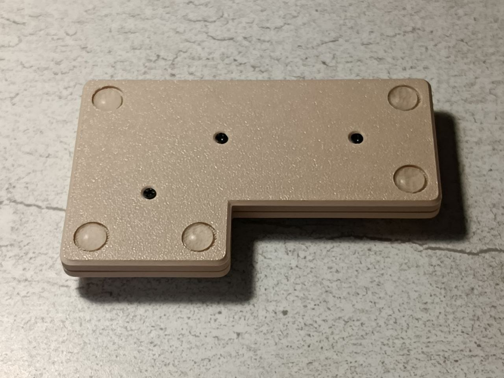

## Finish

Install the keycaps. Then connect the controller to your computer with a cable, press the reset button twice, and flash the firmware.

**Congratulations, you’ve assembled your РИСАТЕНО!**

