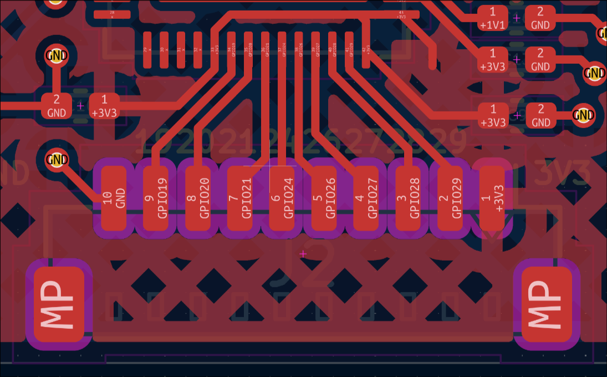

# light
This is an era where the controller is soldered directly onto the PCB, exploring various form factors such as, for example, a PNCATEHO the size of a card. A project can become a flashlight, a development board, or even a portable gaming console. It all depends on the imagination of the community. The main contribution to this era has been made by the authors of the inpudiy community.

## welcome
A credit card–sized RP2040-based PCB with a clean design, PG1316 low-profile switches, and integrated per-key RGB lighting.

  <a href="https://htmlpreview.github.io/?https://github.com/inpudiy/PNCATEHO/blob/master/light/welcome/doc/ibom.html" style="text-decoration: none;">IBOM |</a> 
  <a href="welcome/doc/schematic.pdf" style="text-decoration: none;"> Schematic PDF | </a>
  <a href="welcome/doc/build.md" style="text-decoration: none;"> Build guide</a>

### Features
* 10 low profile keys, PG1316 switches
* Debit card dimensions (ISO/IEC 7810 ID-1)
* Per switch WS2812 2020 led
* Soldered directly onto the RP2040 board
* ESD protection
* 16 MB flash memory
* cutout for a strap
* exposed 10-pin JST connector for connecting modules

### PCB
The current PCB version is v1.1. For ordering, specify a board thickness of 1.6 mm and a stencil for the top side of the board.

  
  

### JST
A BM10B-SRSS-TB connector is installed on the board. This is a 10-pin JST connector with a 1 mm pitch. The leftmost pin is connected to ground, and the rightmost pin provides 3.3V. Between them, the following GPIOs are exposed: 29, 28, 27, 26, 24, 21, 20, 19.

To run the controller, a stable 3.3V supply is required, while the RGB pins should receive 5V.

> [!WARNING]  
> DO NOT attempt to connect an external 3.3V supply while simultaneously powering the board via USB.
