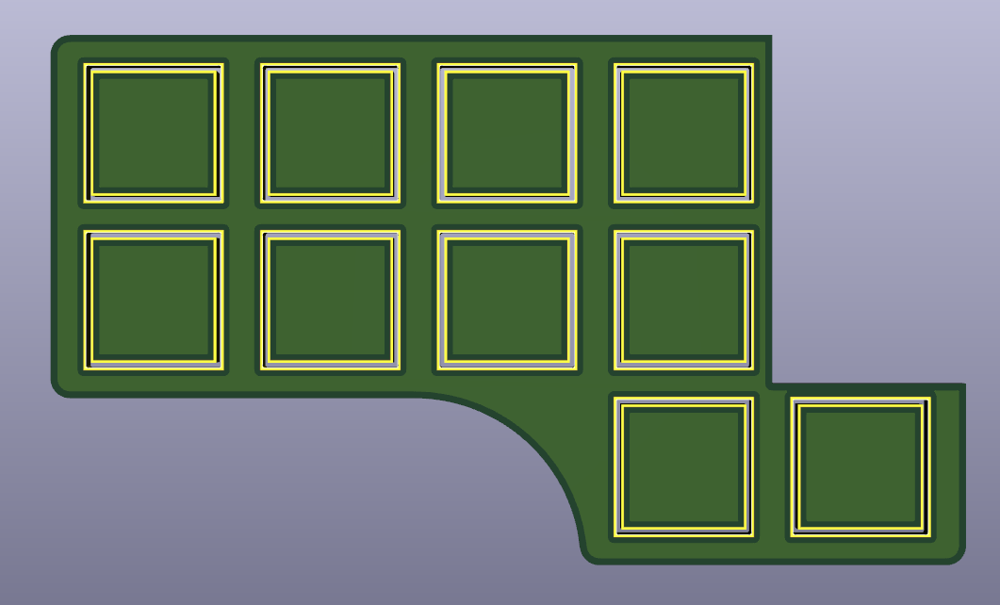

# Plate

No plate is needed for choc, but if you want you can order PCB or laser cut.

Gerber files can be downloaded in 
[releases](https://github.com/aroum/PNCATEHO/releases).

These don't fit version 3 boards because you can't add screw cutouts.